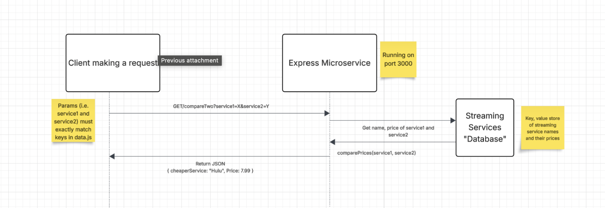

# Price Comparer Microservice

This program takes two streaming service names and returns the name of the cheaper service along with it's price.
It uses a mock database of streaming service names with their monthly subscription price in key-value format.
The database is included in the microservice (data.js)

## Setup Instructions

1. If node is not installed on machine, install it
2. If express is not installed on machine, install it
3. Run 'npm install' in the microservice directory

## Running the Program

1. Run 'npm start' - express server will now be running on port 3000

Optional: Change port # in app.js (Currently set to port 3000)

## API endpoint

GET /compareTwo

Parameters: 
1. Name of streaming service1
2. Name of streaming service2

## Sample JSON response

{ cheapestService: "Hulu", Price: 7.99 }

## UML Diagram

