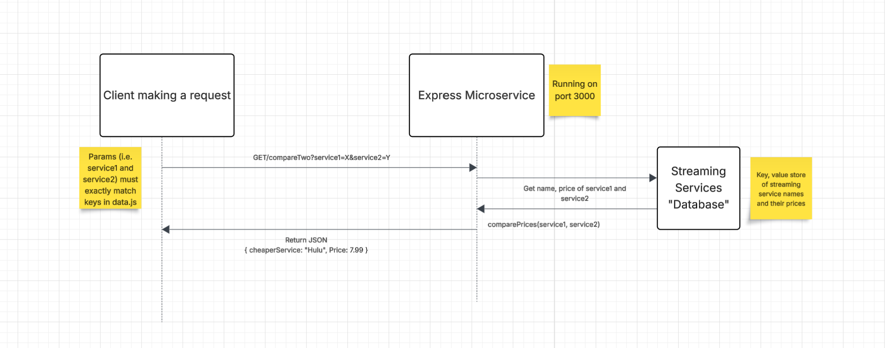

# Price Comparer Microservice

This program takes two streaming service names and returns the name of the cheaper service along with it's price.
It uses a mock database of streaming service names with their monthly subscription price in key-value format.
The database is included in the microservice (data.js)

## Setup Instructions

1. Make sure Node.js is installed on your machine
2. In the project directory, run: 'npm install' 
    - This installs express, cors and other dependencies

## Running the Program

1. Run 'npm start' - express server will now be running on port 3000 by default

Optional: Change port # in app.js (Currently set to port 3000)

## API endpoint

GET /compareTwo

Parameters: 
1. service1 --> Name of first streaming service
2. service2 --> Name of second streaming service

## Example Request

```js

import fetch from 'node-fetch';

const comparePrices = async () => {
  const params = new URLSearchParams({
    service1: 'Netflix',
    service2: 'Amazon Prime Video'
  });

  const response = await fetch(`http://localhost:3000/compareTwo?${params}`);
  const data = await response.json();
  console.log(data);
};

comparePrices();
```

## Example Response

{ cheapestService: "Hulu", Price: 7.99 }


## UML Diagram

